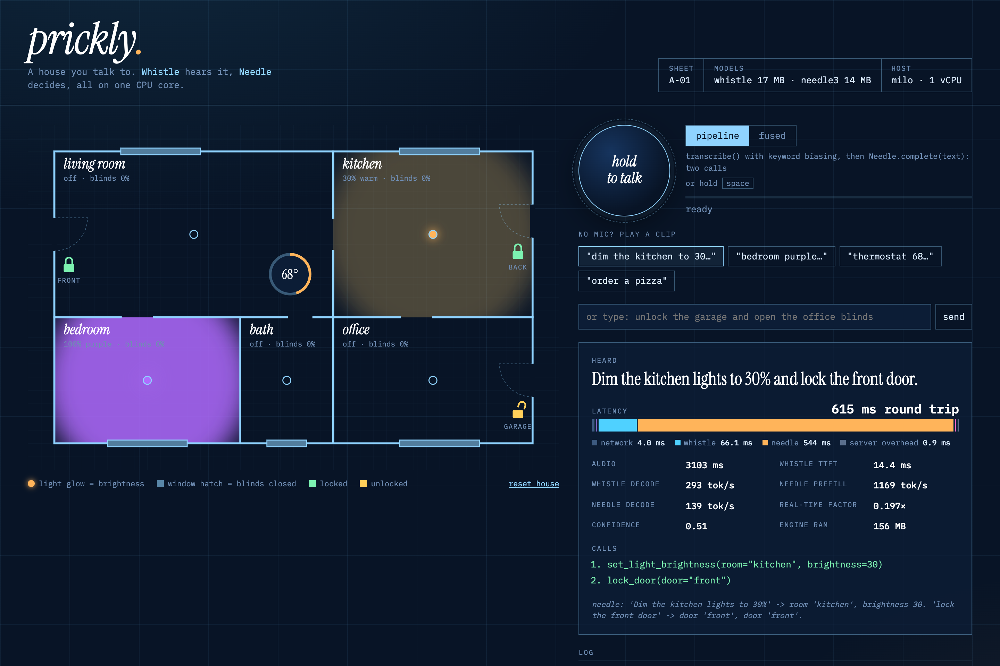

# prickly

A voice-controlled house for trying out [Cactus Compute](https://cactuscompute.com)'s on-device models. Hold to talk, and **Whistle** (speech-to-text) transcribes what you said. **Needle** (tool calling) then turns the transcript into function calls that switch lights, set colors, lock doors, move blinds, and set the thermostat on a live floor plan. Each request shows a latency waterfall, so you can see where the time goes.

Live at **[prickly.newtricks.ai](https://prickly.newtricks.ai)**.



## How it works

```
browser mic ──AudioWorklet──▶ 16 kHz float32 PCM ──POST /api/command──▶ FastAPI
                                                                          │
           ┌──────────────── pipeline ────────────────┐   ┌──── fused ────┐
           │ Whistle.transcribe(audio, keywords=…)    │   │ needle_complete│
           │   └▶ Needle.complete(text, tools=…)      │   │ (audio in,     │
           └──────────────────────────────────────────┘   │  calls out)    │
                                                          └───────────────┘
                                                                          │
                                  function calls ──▶ HouseState ──▶ JSON ──▶ floor plan
```

- **Pipeline mode** makes two calls. Whistle runs with keyword biasing over the house vocabulary (room names, "thermostat", "blinds", …), and its transcript goes to Needle.
- **Fused mode** makes a single engine call that takes audio in and returns tool calls. It's slightly simpler, but keyword biasing isn't available, so "thermostat" sometimes comes out as "Thermistat". Needle usually still picks the right tool.
- Tools are ordinary typed Python methods on `HouseState` (`src/prickly/home.py`), and `needle.build_schema()` builds the schemas from their signatures.
- Needle refuses to make calls it can't ground in the input. "Order a large pepperoni pizza" returns no calls, and the UI shows the calls it suppressed.
- Everything runs on the CPU in one Python process. There's no GPU and no cloud API, and the models never touch the network after the image is built.

## Performance

Each number is the median of 3 runs of the four sample clips in `src/prickly/static/clips/` (2–3 s of speech each), measured on the server with warm models. "Pipeline" is Whistle plus Needle; "fused" is the single combined call.

| Clip (audio length) | M4 Mac, pipeline | M4 Mac, fused | milo, pipeline | milo, fused |
| --- | ---: | ---: | ---: | ---: |
| kitchen-dim (3.1 s) | 129 ms | 106 ms | 3,824 ms | 3,493 ms |
| bedroom-purple (2.9 s) | 128 ms | 146 ms | 4,263 ms | 4,118 ms |
| thermostat (3.0 s) | 91 ms | 92 ms | 3,176 ms | 3,165 ms |
| pizza, no calls (2.0 s) | 87 ms | 121 ms | 1,799 ms | 1,651 ms |

Whistle on its own:

| | M4 Mac (macOS) | milo |
| --- | ---: | ---: |
| Time to first token | 3–8 ms | 220–435 ms |
| Full transcription of ~3 s of audio | 16–30 ms | 720–870 ms |
| Real-time factor | ~0.007 (about 150× faster than real time) | ~0.26 (about 4× faster than real time) |

The hosts:

- **M4 Mac:** Apple M4 running macOS natively (`uv run prickly`).
- **milo:** a DigitalOcean droplet with 1 shared x86_64 vCPU (AVX2) and 1 GB of RAM, shared with about eight other small services.

Footprint:

- Model weights: Whistle is 17 MB and Needle is 14 MB.
- The engine uses about 135–160 MB of resident memory.
- The Docker image is 118 MB with the weights baked in.
- Cold model load and warm-up takes about 0.5 s on the Mac and about 15 s on milo.

What the numbers say:

- **Whistle is genuinely fast.** On the Mac it transcribes faster than you can let go of the button. Even milo's single shared vCPU runs it about 4× faster than real time.
- **Needle is where the time goes on weak CPUs.** It processes all 12 tool schemas on every request. That prefill runs at about 1,000+ tok/s on the M4 but only about 32 tok/s on milo, so milo spends 2–3.5 s in Needle. Fewer or shorter tool definitions would help most there.
- **Native Linux on ARM is fast too.** The same image built for `linux/arm64` and run on the M4 with no Docker limits ran Whistle in 140–290 ms and Needle in 430–970 ms.
- **Don't cap the engine's CPU with cgroups.** Under `docker run --cpus=1` the engine still appears to start a thread for every host core, and they thrash. Needle went from about 0.5 s to about 45 s, and decoding dropped to about 1.5 tok/s. A real 1-vCPU VM like milo doesn't have this problem, because the engine only sees one core. Give the container real cores rather than a quota.

## Running locally

Requires Python 3.12+ and [uv](https://docs.astral.sh/uv/). The first run downloads the Cactus engine and weights (about 31 MB) into `~/.cache/cactus-needle`.

```bash
uv sync
uv run prickly                 # http://localhost:8000
PORT=8077 uv run prickly       # or pick a port
```

Allow the microphone and hold the button (or Space) to talk. The sample-clip buttons work without a mic, and the text box sends straight to Needle, skipping Whistle.

### API

| Route | What it does |
| --- | --- |
| `POST /api/command?mode=pipeline\|fused` | Body is raw little-endian float32 mono samples at 16 kHz, 0.1–30 s. Returns the transcript, executed calls, suppressed calls, timings, and house state. |
| `POST /api/text` | `{"text": "turn on the kitchen light"}` sends text straight to Needle. |
| `GET /api/state`, `POST /api/reset` | Per-browser house state, keyed by a cookie. |
| `GET /healthz` | Liveness check plus the model load time. |

```bash
curl -s localhost:8000/api/text -H 'content-type: application/json' \
  -d '{"text":"unlock the garage and make the office blue"}' | jq '.calls, .timings'
```

## Development

```bash
uv run ruff check . && uv run ruff format --check .
uv run pyright
uv run pytest                      # includes real-model tests
PRICKLY_SKIP_MODELS=1 uv run pytest  # fast: fake engine only
uv run python scripts/tune.py      # A/B utterances against prompt/tool variants
```

Layout:

```
src/prickly/
  engine.py   Whistle + Needle wrapper: one lock, warm-up, pipeline/fused modes, timings
  home.py     HouseState and its tool methods, schemas, keyword list, system prompt
  main.py     FastAPI app: sessions, validation, routes, static files
  static/     index.html, app.js (AudioWorklet capture + UI), styles.css, sample clips
tests/        unit tests, API tests with a fake engine, real-model tests
scripts/      tune.py prompt/tool tuning harness
```

Engine notes:

- The native engine is one library per process. It holds one active model set and isn't thread-safe, so `Engine` serializes calls behind a lock and the server runs a single uvicorn worker.
- Fused mode calls the engine through `needle._lib()`, a private entry point that may change between cactus-needle releases.
- `NEEDLE_TELEMETRY=0` turns off cactus-needle's anonymous usage pings.

## Deployment

Pushing to `main` runs CI (ruff, pyright, pytest, and a Docker build). It then pushes `ghcr.io/chrisyerga/prickly:<sha>` and registers the service on milo with [Porch](https://www.npmjs.com/package/@lindale/porch), which handles DNS, Caddy routing and TLS. The Docker build downloads and warms up the models, so a broken engine fails the build rather than the deploy. See [PORCH.md](PORCH.md) for secrets and host details.
